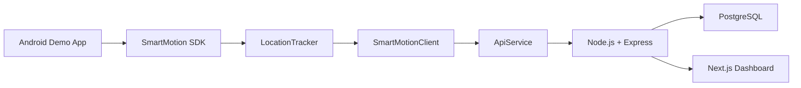
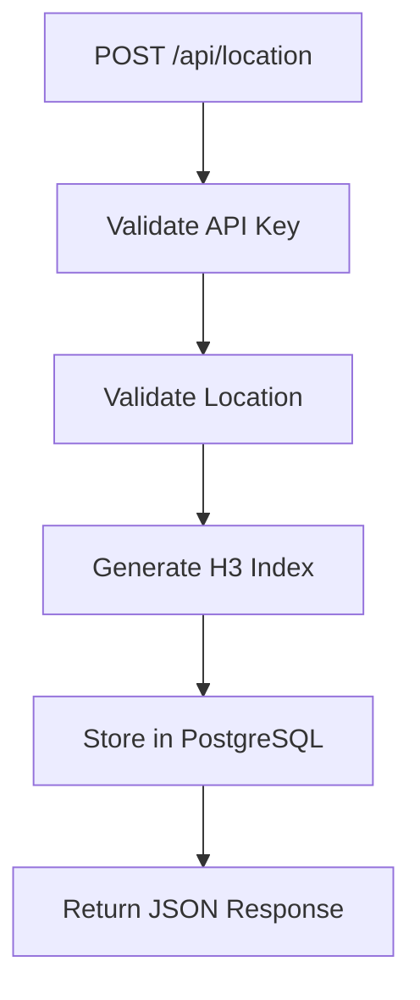
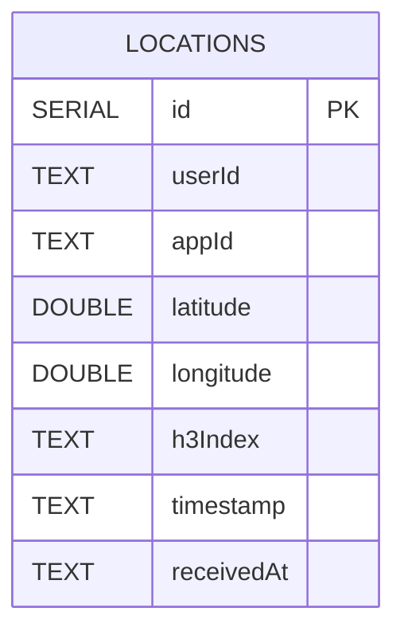
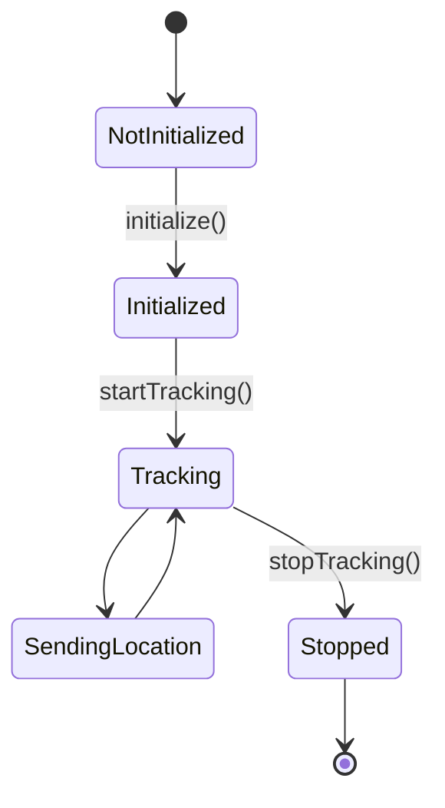
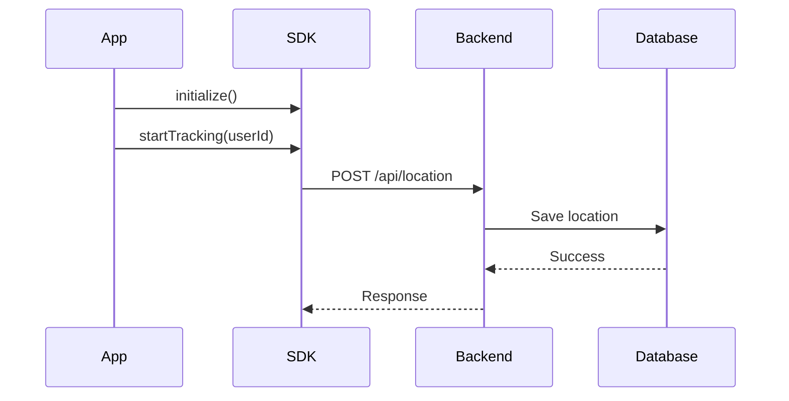

<p align="center">
  
</p>

<h1 align="center">SmartMotion SDK</h1>

<p align="center">
Lightweight Android SDK for real-time location tracking, backend processing and live analytics.
</p>

---

# Contents

- [Overview](#overview)
- [Features](#features)
- [Technology Stack](#technology-stack)
- [Project Structure](#project-structure)
- [Installation](#installation)
- [Implementation](#implementation)
- [Quick Start](#quick-start)
- [SDK Public API](#sdk-public-api)
- [REST API](#rest-api)
- [Database](#database)
- [Performance](#performance)
- [System Diagrams](#system-diagrams)
- [Screenshots](#screenshots)
- [Demo Video](#demo-video)
- [Author](#author)

---

# Overview

SmartMotion SDK is an Android SDK that enables applications to collect GPS locations in real time and send them securely to a backend server.

The backend validates every request, generates an H3 spatial index for each location, stores the data in PostgreSQL, and exposes REST endpoints that are consumed by the SmartMotion Console.

The SmartMotion Console provides live monitoring through an interactive dashboard that includes statistics, H3 heatmaps and analytics.

---

# Features

- Android SDK for real-time location tracking
- Simple SDK integration
- Continuous GPS updates
- Secure communication using Retrofit
- API Key authentication
- H3 spatial indexing
- PostgreSQL storage
- Live monitoring dashboard
- Interactive H3 heatmap
- Crowd analytics
- Connected applications monitoring

---

# Technology Stack

| Layer | Technology |
|--------|------------|
| Mobile SDK | Kotlin |
| Location Services | Google Play Services |
| Networking | Retrofit 2 |
| HTTP Client | OkHttp |
| JSON | Gson |
| Backend | Node.js + Express |
| Database | PostgreSQL |
| Spatial Indexing | H3 |
| Dashboard | Next.js |
| Frontend | React |
| Maps | Leaflet |
| Charts | Recharts |

---

# Project Structure

```text
SmartMotionSDK
│
├── smartmotion-sdk/
├── backend-server/
├── smartmotion-console/
├── assets/
├── diagrams/
├── docs/
└── README.md
```

---

# Installation
Add the SmartMotion SDK dependency to your Android project.

```gradle
dependencies {
    implementation("com.github.MayaYakobi131:smartmotion-sdk:1.0.0")
}
```

Minimum requirements:

- Android API 26+
- Internet permission
- Fine location permission

Required permissions:

```xml
<uses-permission android:name="android.permission.INTERNET"/>

<uses-permission
    android:name="android.permission.ACCESS_FINE_LOCATION"/>

<uses-permission
    android:name="android.permission.ACCESS_COARSE_LOCATION"/>
```

---

# Implementation

The SmartMotion platform is composed of three main modules.

### Android SDK

Responsible for:

- SDK initialization
- GPS location tracking
- Creating `LocationData`
- Sending location updates to the backend

### Backend Server

Responsible for:

- API Key validation
- Location validation
- H3 index generation
- PostgreSQL storage
- Analytics generation

### SmartMotion Console

Responsible for:

- Displaying live users
- Displaying H3 heatmaps
- Displaying analytics
- Displaying connected applications

---

# Quick Start

## 1. Create the SDK configuration

```kotlin
val config = SmartMotionConfig(
    apiKey = "YOUR_API_KEY",
    serverUrl = "http://YOUR_SERVER:3000"
)
```

## 2. Initialize the SDK

```kotlin
SmartMotion.initialize(
    context = this,
    config = config
)
```

## 3. Start location tracking

```kotlin
SmartMotion.startTracking(
    userId = "user_123"
)
```

While tracking is active, the SDK:

- Requests GPS updates
- Creates `LocationData`
- Sends every location to the backend server

## 4. Stop tracking

```kotlin
SmartMotion.stopTracking()
```

Tracking stops immediately and no additional location updates are sent.

---

# SDK Public API

| Function | Description |
|----------|-------------|
| `initialize(context, config)` | Initializes the SDK. |
| `isInitialized()` | Returns whether the SDK is initialized. |
| `startTracking(userId)` | Starts GPS tracking. |
| `stopTracking()` | Stops GPS tracking. |
| `sendLocation(locationData)` | Sends a location manually. |

---

# Internal Components

| Class | Responsibility |
|--------|----------------|
| `LocationTracker` | Receives GPS updates using Google Play Services. |
| `SmartMotionClient` | Connects the SDK with the networking layer. |
| `ApiService` | Sends HTTP requests using Retrofit. |
| `LocationData` | Represents a location event. |

---

# REST API

| Method | Endpoint | Description |
|---------|----------|-------------|
| POST | `/api/location` | Save a location update |
| GET | `/api/locations` | Latest location for each user |
| GET | `/api/stats` | Dashboard statistics |
| GET | `/api/heatmap` | H3 heatmap data |
| GET | `/api/top-areas` | Most active H3 cells |
| GET | `/api/apps` | Connected applications |
| GET | `/api/health` | Server health status |

---

# Authentication

Every SDK request includes an API Key:

```http
x-api-key: sm_demo_key_123
```

The backend validates:

- API Key existence
- Active API Key
- Request payload

Invalid requests return:

```http
401 Unauthorized
```
# Sample Request

```http
POST /api/location
```

```json
{
  "userId": "user_123",
  "latitude": 32.0822,
  "longitude": 34.7688,
  "timestamp": "2026-07-05T12:30:00Z"
}
```

# Sample Response

```json
{
  "success": true,
  "message": "Location saved successfully",
  "data": {
    "id": "live_user_123",
    "eventId": 125,
    "userId": "user_123",
    "appId": "demo_android_app",
    "latitude": 32.0822,
    "longitude": 34.7688,
    "timestamp": "2026-07-05T12:30:00Z",
    "h3Index": "892d80cc173ffff",
    "updatedAt": "2026-07-05T12:30:02Z"
  }
}
```

---

# Database

SmartMotion stores all location events in a PostgreSQL database.

| Column | Type |
|---------|------|
| id | SERIAL |
| userId | TEXT |
| appId | TEXT |
| latitude | DOUBLE PRECISION |
| longitude | DOUBLE PRECISION |
| h3Index | TEXT |
| timestamp | TEXT |
| receivedAt | TEXT |

Database indexes:

- Primary Key (`id`)
- Index on `userId`
- Index on `h3Index`

> **Note:** API Keys are stored in `config/apiKeys.js` and are validated before inserting data into the database.

---

# Performance

| Operation | Complexity |
|-----------|------------|
| Insert location | **O(1)** |
| Search by User ID | **O(log n)** |
| Search by H3 Index | **O(log n)** |
| Latest locations | **O(n)** |
| Heatmap generation | **O(n)** |

---

# System Diagrams

## Overall Architecture



---

## Backend Flow



---

## Database Model



---

## SDK State Diagram



---

## Request Sequence



---
# Screenshots

The following screenshots present the main components of the SmartMotion platform.

---

## Android Demo Application

<p align="center">
  
</p>

The Android application initializes the SDK, starts location tracking and sends live location updates to the backend.

---

## SmartMotion Console

<p align="center">
  
</p>

The dashboard displays live statistics, connected applications and active users.

---

## Live H3 Heatmap

<p align="center">
  
</p>

The heatmap visualizes active users grouped into H3 spatial cells.

---

## Analytics

<p align="center">
  
</p>

The analytics view presents the busiest H3 cells and the current crowd distribution.

---

# Demo Video

A short demonstration video will be added after the final recording.

The video demonstrates:

- SDK initialization
- Starting location tracking
- Sending location updates
- Backend processing
- Live dashboard updates
- H3 heatmap visualization

> **Demo Video:** *(Link will be added here.)*

---

# Author

Developed by:

**Maya Yakobi**