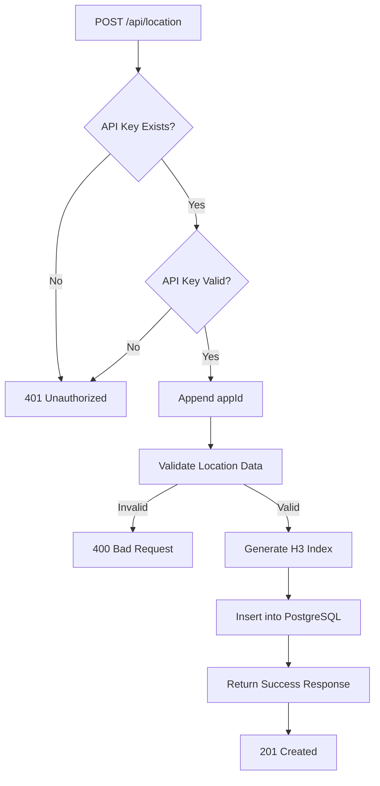
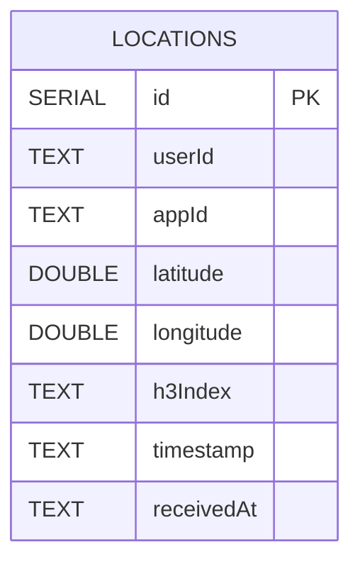
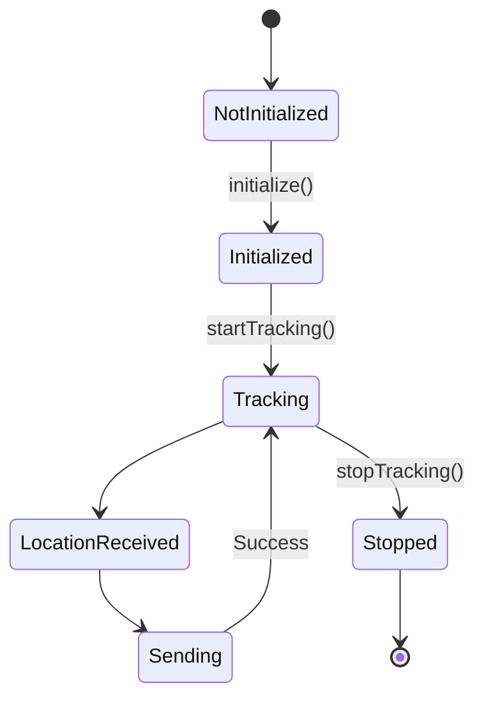
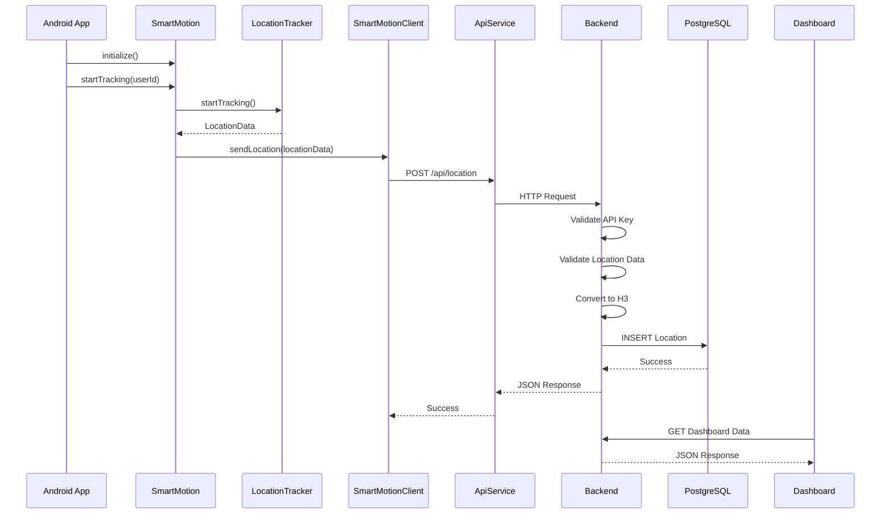

<p align="center">
  
</p>

<h1 align="center">SmartMotion SDK</h1>

<p align="center">
A lightweight Android SDK for real-time location tracking and live analytics.
</p>

<p align="center">


</p>

---

# Table of Contents

- Overview
- Features
- Technology Stack
- Project Structure
- Installation
- Implementation
- Quick Start
- SDK Public API
- Backend REST API
- Database
- Performance
- System Diagrams
- Screenshots
- Demo Video
- Authors

---

# Overview

SmartMotion SDK is an Android Software Development Kit (SDK) designed to simplify real-time location tracking inside Android applications.

The SDK collects GPS locations using Google's Location Services, sends location updates to a backend server through a secure REST API, and enables developers to monitor live activity using a web dashboard.

The backend validates every request, converts each geographic location into an H3 spatial index, stores the information in a PostgreSQL database, and exposes analytics endpoints consumed by the SmartMotion Console.

The project is divided into three main components:

- Android SDK
- Backend Server
- SmartMotion Console

---

# Features

The SmartMotion platform provides the following capabilities:

- Android SDK for location tracking
- Simple SDK initialization
- Continuous GPS location updates
- Secure REST API communication
- API Key authentication
- H3 spatial indexing
- PostgreSQL database storage
- Live dashboard
- Heatmap visualization
- Live user monitoring
- Application monitoring
- Analytics charts

---

# Technology Stack

| Layer | Technology |
|--------|------------|
| Mobile SDK | Kotlin |
| Android Location | Google Play Services |
| Networking | Retrofit |
| HTTP Client | OkHttp |
| JSON | Gson |
| Backend | Node.js |
| Framework | Express.js |
| Database | PostgreSQL |
| Spatial Index | H3 |
| Dashboard | Next.js |
| Frontend | React |
| Maps | Leaflet |
| Charts | Recharts |

---

# Project Structure

```text
SmartMotionSDK
│
├── assets
│   ├── logo.png
│   ├── android-demo.png
│   ├── dashboard-overview.png
│   ├── heatmap.png
│   └── analytics.png
│
├── smartmotion-sdk
│   ├── SmartMotion.kt
│   ├── SmartMotionClient.kt
│   ├── SmartMotionConfig.kt
│   ├── SmartMotionListener.kt
│   ├── network
│   ├── tracking
│   └── models
│
├── android-demo
│
├── backend-server
│   ├── controllers
│   ├── routes
│   ├── services
│   ├── utils
│   └── config
│
├── smartmotion-console
│
├── diagrams
│
├── docs
│
└── README.md
```

---

# Installation

Add the SDK dependency to your Android project.

```gradle
dependencies {
    implementation("com.github.MayaYakobi131:smartmotion-sdk:1.0.0")
}
```

The SDK requires:

- Android API 26 or higher
- Internet permission
- Fine Location permission

Required Android permissions:

```xml
<uses-permission android:name="android.permission.INTERNET"/>

<uses-permission
    android:name="android.permission.ACCESS_FINE_LOCATION"/>

<uses-permission
    android:name="android.permission.ACCESS_COARSE_LOCATION"/>
```

---

# Quick Start

### 1. Create the SDK configuration

```kotlin
val config = SmartMotionConfig(
    apiKey = "YOUR_API_KEY",
    serverUrl = "http://YOUR_SERVER:3000"
)
```

---

### 2. Initialize the SDK

```kotlin
SmartMotion.initialize(
    context = this,
    config = config
)
```

---

### 3. Start tracking

```kotlin
SmartMotion.startTracking(
    userId = "user_123"
)
```

The SDK will:

- Request location updates
- Create a `LocationData` object
- Send the location to the backend server
- Continue sending updates while tracking is active

---

### 4. Stop tracking

```kotlin
SmartMotion.stopTracking()
```

The SDK stops requesting GPS updates and ends the active tracking session.

---
# Implementation

SmartMotion SDK follows a modular architecture where each component has a single responsibility.

The Android application communicates only with the public `SmartMotion` object.

Internally, the SDK performs the following steps:

1. Initializes the SDK using `SmartMotion.initialize()`.
2. Creates a `SmartMotionClient`.
3. Starts the `LocationTracker`.
4. Collects GPS updates using Google Play Services.
5. Creates a `LocationData` object.
6. Sends the location through `ApiService`.
7. The backend validates the request.
8. The backend converts the coordinates into an H3 cell.
9. The backend stores the location in PostgreSQL.
10. The SmartMotion Console retrieves the processed data through REST endpoints.

---

# SDK Public API

The SDK exposes a small and simple API for Android developers.

| Function | Description |
|-----------|-------------|
| `initialize(context, config)` | Initializes the SDK. |
| `isInitialized()` | Returns whether the SDK has been initialized. |
| `startTracking(userId)` | Starts continuous location tracking. |
| `stopTracking()` | Stops active location tracking. |
| `sendLocation(locationData)` | Sends a location manually to the backend server. |

---

# Internal Components

The following classes are internal SDK components and are not intended for direct use by developers.

| Component | Responsibility |
|-----------|----------------|
| `LocationTracker` | Receives GPS updates from Google Play Services. |
| `SmartMotionClient` | Connects the SDK to the networking layer. |
| `ApiService` | Sends HTTP requests using Retrofit. |
| `SmartMotionApi` | Defines backend REST endpoints. |
| `LocationData` | Represents a single location update. |

---

# Backend REST API

The backend exposes the following REST endpoints.

| Method | Endpoint | Description |
|---------|----------|-------------|
| POST | `/api/location` | Receives a location update from the SDK. |
| GET | `/api/locations` | Returns the latest location of every active user. |
| GET | `/api/stats` | Returns dashboard statistics. |
| GET | `/api/heatmap` | Returns H3 heatmap data. |
| GET | `/api/top-areas` | Returns the most active H3 cells. |
| GET | `/api/apps` | Returns connected applications. |
| GET | `/api/health` | Returns server status. |

---

# Authentication

Every request sent by the SDK contains an API Key inside the request header.

```http
x-api-key: sm_demo_key_123
```

The backend validates:

- API Key existence
- API Key validity
- Active application

If validation fails, the backend returns:

```http
401 Unauthorized
```

---

# Sample Request

```http
POST /api/location
```

Headers

```http
Content-Type: application/json
x-api-key: sm_demo_key_123
```

Body

```json
{
  "userId": "user_123",
  "latitude": 32.0822,
  "longitude": 34.7688,
  "timestamp": "2026-07-05T12:30:00Z"
}
```

---

# Sample Response

```json
{
  "success": true,
  "message": "Location saved successfully",
  "data": {
    "id": "live_user_123",
    "eventId": 125,
    "userId": "user_123",
    "appId": "demo_android_app",
    "latitude": 32.0822,
    "longitude": 34.7688,
    "timestamp": "2026-07-05T12:30:00Z",
    "h3Index": "89283082813ffff",
    "updatedAt": "2026-07-05T12:30:02Z"
  }
}
```

---

# Database

The backend stores all location events in a PostgreSQL database.

## Table: `locations`

| Column | Type | Description |
|---------|------|-------------|
| id | SERIAL | Primary Key |
| userId | TEXT | User identifier |
| appId | TEXT | Application identifier |
| latitude | DOUBLE PRECISION | Latitude |
| longitude | DOUBLE PRECISION | Longitude |
| h3Index | TEXT | H3 spatial index |
| timestamp | TEXT | Timestamp created by the SDK |
| receivedAt | TEXT | Timestamp created by the backend |

---

# Database Indexes

| Index | Purpose |
|--------|---------|
| `PRIMARY KEY(id)` | Fast row access |
| `idx_locations_userId` | Search by user |
| `idx_locations_h3Index` | Search by H3 cell |

**Note:** API keys and application metadata are currently managed through the backend configuration file (`config/apiKeys.js`) and are not stored in the database.

---

# Performance

The backend uses database indexes to improve query performance.

| Operation | Complexity |
|-----------|------------|
| Insert location | **O(1)** |
| Search by User ID | **O(log n)** |
| Search by H3 Index | **O(log n)** |
| Latest locations query | **O(n)** |
| Heatmap generation | **O(n)** |
| Dashboard statistics | **O(n)** |

---

# Design Considerations

The project was designed with the following principles:

- Lightweight SDK
- Simple Android integration
- Modular architecture
- REST-based communication
- Secure API Key validation
- Indexed database queries
- Real-time location analytics

---
# System Diagrams

The following diagrams describe the SmartMotion SDK architecture, internal workflow, backend communication, and database structure.

---

# System Architecture Diagram

```mermaid
flowchart LR

subgraph Android["Android Demo"]
    A["MainActivity"]
end

subgraph SDK["SmartMotion SDK"]
    B["SmartMotion"]
    C["LocationTracker"]
    D["SmartMotionClient"]
    E["ApiService"]
end

subgraph Backend["Backend Server"]
    F["Express API"]
    G["API Key Validation"]
    H["Location Validation"]
    I["H3 Service"]
    J["PostgreSQL"]
end

subgraph Dashboard["SmartMotion Console"]
    K["Next.js Dashboard"]
end

A -->|initialize()| B
A -->|startTracking(userId)| B

B --> C
C -->|LocationData| B
B --> D
D --> E

E -->|POST /api/location| F

F --> G
G --> H
H --> I
I --> J

K -->|GET /stats| F
K -->|GET /locations| F
K -->|GET /heatmap| F
K -->|GET /top-areas| F
K -->|GET /apps| F
```

---

# Backend Flow Diagram



---

# Entity Relationship Diagram (ERD)



**Note:** Application information and API Keys are managed through the backend configuration file (`config/apiKeys.js`) and are not stored inside the PostgreSQL database.

---

# State Diagram



---

# Sequence Diagram



---

# Architecture Notes

The SmartMotion platform is divided into three independent modules.

### Android SDK

Responsible for:

- SDK initialization
- GPS tracking
- Creating `LocationData`
- Sending REST requests

---

### Backend

Responsible for:

- API Key validation
- Location validation
- H3 conversion
- Database storage
- Analytics generation

---

### SmartMotion Console

Responsible for:

- Live dashboard
- Heatmap visualization
- Analytics charts
- Connected applications
- Active users monitoring

---

# Design Advantages

The architecture provides:

- Separation of concerns
- Modular implementation
- Lightweight Android SDK
- Secure REST communication
- Indexed PostgreSQL queries
- Easy SDK integration
- Real-time visualization
# Screenshots

The following screenshots present the main components of the SmartMotion platform.

---

## Android Demo Application

<p align="center">

</p>

The Android demo application initializes the SDK, requests location permissions, starts and stops tracking, and sends location updates to the backend server.

---

## SmartMotion Console Dashboard

<p align="center">

</p>

The dashboard displays live statistics received from the backend, including active users, connected applications, active H3 areas and historical events.

---

## Live H3 Heatmap

<p align="center">

</p>

The heatmap visualizes user density using H3 spatial indexing. Each cell represents a geographic area and is colored according to the number of active users.

---

## Analytics Dashboard

<p align="center">

</p>

The analytics section displays real-time charts summarizing active users per H3 cell and crowd distribution across monitored areas.

---

# Demo Video

A demonstration video of the SmartMotion platform will be added after the final recording.

The demonstration should include:

1. Running the backend server.
2. Opening the SmartMotion Console.
3. Launching the Android Demo application.
4. Initializing the SDK.
5. Granting location permission.
6. Starting location tracking.
7. Showing live requests reaching the backend.
8. Showing new rows inserted into PostgreSQL.
9. Refreshing the dashboard.
10. Displaying updated statistics, heatmap and analytics.
11. Stopping location tracking.

**Demo Video**

> *(Video link will be added here.)*

---

# Project Summary

SmartMotion SDK provides a complete end-to-end solution for real-time location tracking.

The project consists of:

- Android SDK written in Kotlin
- Node.js backend server
- PostgreSQL database
- H3 spatial indexing
- Next.js analytics dashboard

Together, these components demonstrate the complete lifecycle of location data, from mobile collection through backend processing to real-time visualization.

---

# Authors

Developed as part of the SmartMotion SDK academic project.

### Team Members

- Maya Yakobi
- Amit Yehezkel
- Maya Oded
- Shahar Attias

---

# License

This project was developed for academic purposes only.

---

# Acknowledgments

The project was built using the following technologies:

- Kotlin
- Google Play Services Location
- Retrofit
- OkHttp
- Node.js
- Express.js
- PostgreSQL
- H3
- Next.js
- React
- Leaflet
- Recharts

---

<p align="center">

# SmartMotion SDK

### Real-Time Location Tracking Platform

**Android SDK • Backend Server • PostgreSQL • H3 • Next.js Dashboard**

</p>