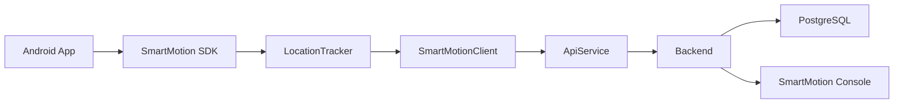
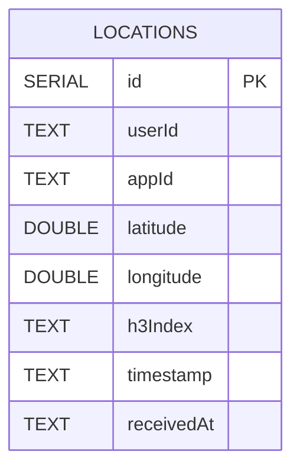
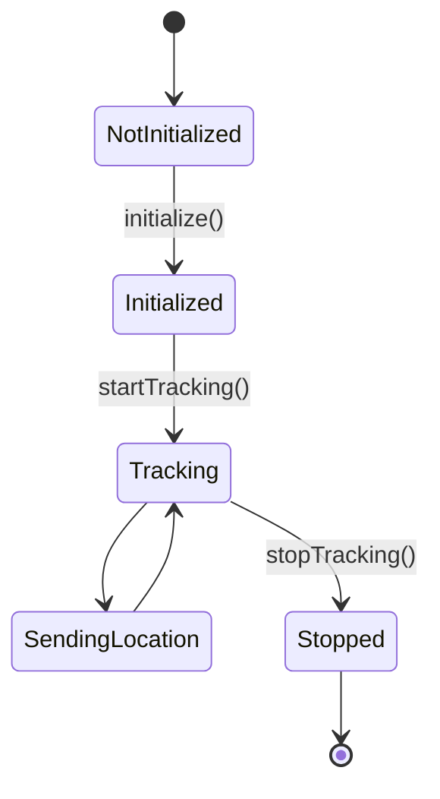
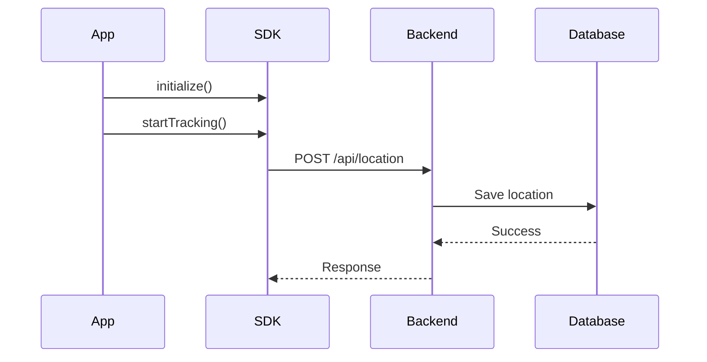

<p align="center">
  
</p>

<h1 align="center">SmartMotion SDK</h1>

<p align="center">
Lightweight Android SDK for real-time location tracking, backend processing and live location analytics.
</p>

<p align="center">


</p>

---

# Table of Contents

- [Overview](#overview)
- [Features](#features)
- [Technology Stack](#technology-stack)
- [Project Structure](#project-structure)
- [Installation](#installation)
- [Implementation](#implementation)
- [Quick Start](#quick-start)
- [SDK Public API](#sdk-public-api)
- [REST API](#rest-api)
- [Database](#database)
- [Performance](#performance)
- [System Diagrams](#system-diagrams)
- [Screenshots](#screenshots)
- [Demo Video](#demo-video)
- [Authors](#authors)

---

# Overview

SmartMotion SDK is an Android SDK developed for collecting GPS locations in real time and transmitting them securely to a backend server.

The SDK is responsible for initializing the tracking service, receiving location updates through Google Play Services, creating location events, and sending them to the backend using Retrofit.

The backend validates each request, verifies the API Key, converts every location into an H3 spatial index, stores the data in PostgreSQL, and exposes REST endpoints that are consumed by the SmartMotion Console.

The SmartMotion Console is a Next.js web application that displays live user locations, H3 heatmaps, crowd statistics and connected applications.

---

# Features

- Android SDK for real-time location tracking
- Simple SDK initialization
- Continuous GPS location updates
- Secure REST communication using Retrofit
- API Key validation
- H3 geospatial indexing
- PostgreSQL data storage
- Live dashboard
- Interactive H3 heatmap
- Crowd analytics
- Connected applications monitoring
- Modular project architecture

---

# Technology Stack

| Layer | Technology |
|--------|------------|
| Mobile SDK | Kotlin |
| Location Services | Google Play Services |
| Networking | Retrofit 2 |
| HTTP Client | OkHttp |
| JSON | Gson |
| Backend | Node.js |
| REST API | Express.js |
| Database | PostgreSQL |
| Spatial Indexing | H3 |
| Dashboard | Next.js |
| Frontend | React |
| Maps | Leaflet |
| Charts | Recharts |

---

# Project Structure

```text
SmartMotionSDK
│
├── assets/
│
├── smartmotion-sdk/
│   ├── models/
│   ├── network/
│   ├── tracking/
│   ├── SmartMotion.kt
│   ├── SmartMotionClient.kt
│   ├── SmartMotionConfig.kt
│   └── SmartMotionListener.kt
│
├── backend-server/
│   ├── config/
│   ├── controllers/
│   ├── routes/
│   ├── services/
│   └── utils/
│
├── smartmotion-console/
│
├── diagrams/
│
├── docs/
│
└── README.md
```

---

# Installation
Add the SmartMotion SDK dependency to your Android project.

```gradle
dependencies {
    implementation("com.github.MayaYakobi131:smartmotion-sdk:1.0.0")
}
```

Minimum requirements:

- Android API 26+
- Internet permission
- Fine Location permission

Required permissions:

```xml
<uses-permission android:name="android.permission.INTERNET"/>

<uses-permission
    android:name="android.permission.ACCESS_FINE_LOCATION"/>

<uses-permission
    android:name="android.permission.ACCESS_COARSE_LOCATION"/>
```

---

# Implementation

The SmartMotion platform consists of three independent modules:

### Android SDK

Responsible for:

- Initializing the SDK
- Receiving GPS location updates
- Creating `LocationData`
- Sending location updates to the backend

### Backend Server

Responsible for:

- API Key validation
- Location data validation
- H3 index generation
- PostgreSQL storage
- Analytics data generation

### SmartMotion Console

Responsible for:

- Displaying live users
- Displaying H3 heatmaps
- Displaying analytics
- Displaying connected applications

---

# Quick Start

## 1. Create the SDK configuration

```kotlin
val config = SmartMotionConfig(
    apiKey = "YOUR_API_KEY",
    serverUrl = "http://YOUR_SERVER:3000"
)
```

---

## 2. Initialize the SDK

```kotlin
SmartMotion.initialize(
    context = this,
    config = config
)
```

---

## 3. Start location tracking

```kotlin
SmartMotion.startTracking(
    userId = "user_123"
)
```

While tracking is active, the SDK:

- Requests GPS updates
- Creates `LocationData`
- Sends every location to the backend server

---

## 4. Stop tracking

```kotlin
SmartMotion.stopTracking()
```

Tracking immediately stops and no additional location updates are sent.

---

# SDK Public API

The SDK exposes a small public API for Android applications.

| Function | Description |
|-----------|-------------|
| `initialize(context, config)` | Initializes the SDK. |
| `isInitialized()` | Checks whether the SDK has already been initialized. |
| `startTracking(userId)` | Starts GPS tracking. |
| `stopTracking()` | Stops GPS tracking. |
| `sendLocation(locationData)` | Sends a location manually to the backend. |

---

# Internal Components

These classes are used internally by the SDK.

| Class | Responsibility |
|--------|----------------|
| `LocationTracker` | Receives GPS updates. |
| `SmartMotionClient` | Connects the SDK to the networking layer. |
| `ApiService` | Sends HTTP requests using Retrofit. |
| `LocationData` | Represents a location event. |

---
# REST API

The backend exposes REST endpoints used by the Android SDK and the SmartMotion Console.

| Method | Endpoint | Description |
|---------|----------|-------------|
| POST | `/api/location` | Save a new location update |
| GET | `/api/locations` | Get the latest location of each active user |
| GET | `/api/stats` | Get dashboard statistics |
| GET | `/api/heatmap` | Get H3 heatmap data |
| GET | `/api/top-areas` | Get the busiest H3 cells |
| GET | `/api/apps` | Get connected applications |
| GET | `/api/health` | Check server status |

---

# Authentication

Every request sent by the SDK includes an API Key inside the request header.

```http
x-api-key: sm_demo_key_123
```

The backend validates:

- API Key exists
- API Key is active
- Request data is valid

Invalid requests return:

```http
401 Unauthorized
```

---

# Sample Request

```http
POST /api/location
```

```json
{
  "userId": "user_123",
  "latitude": 32.0822,
  "longitude": 34.7688,
  "timestamp": "2026-07-05T12:30:00Z"
}
```

---

# Sample Response

```json
{
  "success": true,
  "message": "Location saved successfully",
  "data": {
    "id": "live_user_123",
    "eventId": 125,
    "userId": "user_123",
    "appId": "demo_android_app",
    "latitude": 32.0822,
    "longitude": 34.7688,
    "timestamp": "2026-07-05T12:30:00Z",
    "h3Index": "89283082813ffff",
    "updatedAt": "2026-07-05T12:30:02Z"
  }
}
```

---

# Database

SmartMotion stores location events in a PostgreSQL database.

| Column | Type |
|---------|------|
| id | SERIAL |
| userId | TEXT |
| appId | TEXT |
| latitude | DOUBLE PRECISION |
| longitude | DOUBLE PRECISION |
| h3Index | TEXT |
| timestamp | TEXT |
| receivedAt | TEXT |

Database indexes:

- Primary Key (`id`)
- Index on `userId`
- Index on `h3Index`

**Note:** API Keys are stored in the backend configuration (`apiKeys.js`) and are not part of the database.

---

# Performance

| Operation | Complexity |
|-----------|------------|
| Insert Location | **O(1)** |
| Search by User | **O(log n)** |
| Search by H3 Cell | **O(log n)** |
| Latest User Locations | **O(n)** |
| Heatmap Generation | **O(n)** |

---

# System Diagrams

## System Architecture



---

## Entity Relationship Diagram



---

## State Diagram



---

## Sequence Diagram



---
# Screenshots

The following screenshots demonstrate the SmartMotion platform.

---

## Android Demo Application

<p align="center">
  
</p>

The Android demo application initializes the SDK, starts and stops location tracking, and sends location updates to the backend.

---

## SmartMotion Console

<p align="center">
  
</p>

The SmartMotion Console displays live statistics collected from the backend, including active users, connected applications and monitored H3 areas.

---

## Live Heatmap

<p align="center">
  
</p>

The heatmap displays the current distribution of active users using H3 spatial indexing.

---

## Analytics

<p align="center">
  
</p>

The analytics dashboard presents the busiest H3 cells and the current distribution of active users.

---

# Demo Video

A short demonstration video will be added after the final recording.

The demonstration should include:

1. Running the backend server.
2. Opening the SmartMotion Console.
3. Running the Android Demo application.
4. Initializing the SDK.
5. Starting location tracking.
6. Receiving live location updates.
7. Displaying new data in the dashboard.
8. Stopping location tracking.

**Demo Video**

> *(Video link will be added here.)*

---

# Authors

Developed as part of the SmartMotion SDK academic project.

**Team Members**

- Maya Yakobi
- Amit Yehezkel
- Maya Oded
- Shahar Attias

---

# License

This project was developed for academic purposes.

---

<p align="center">

### SmartMotion SDK

Real-Time Location Tracking Platform

Android SDK • Node.js • PostgreSQL • H3 • Next.js

</p>