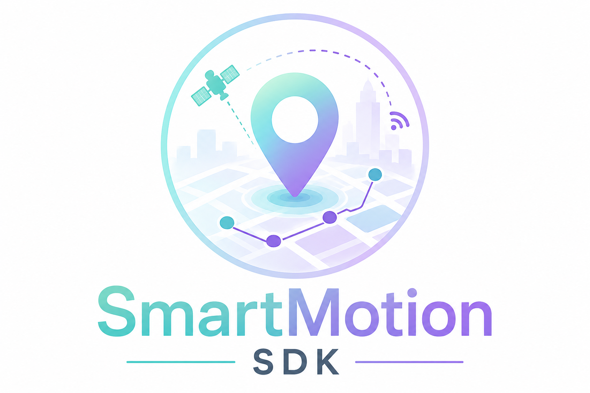
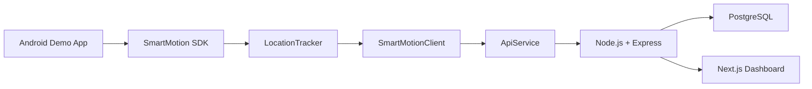
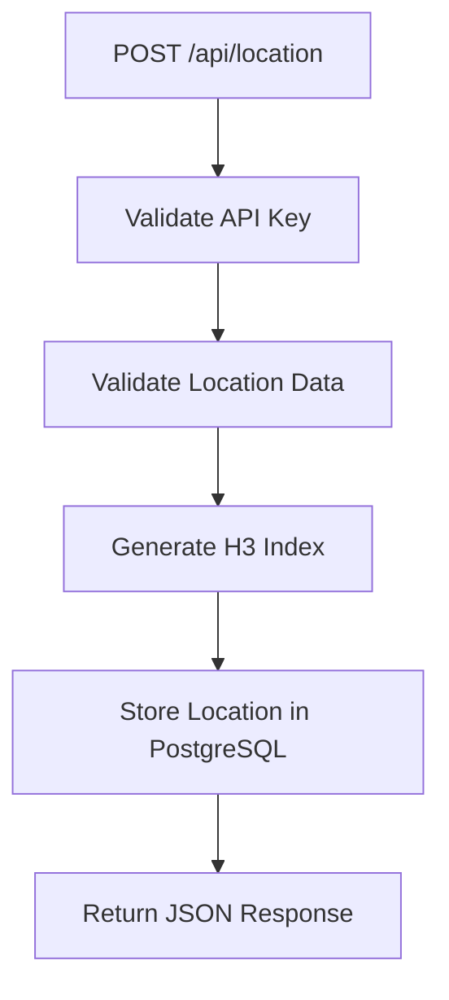
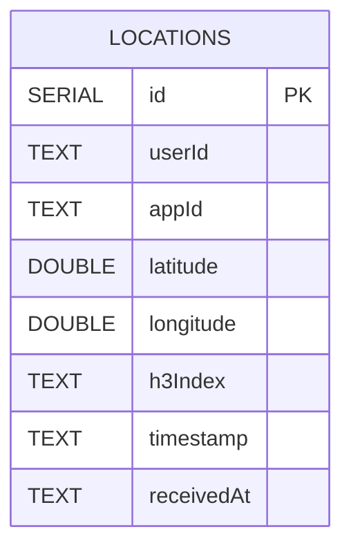
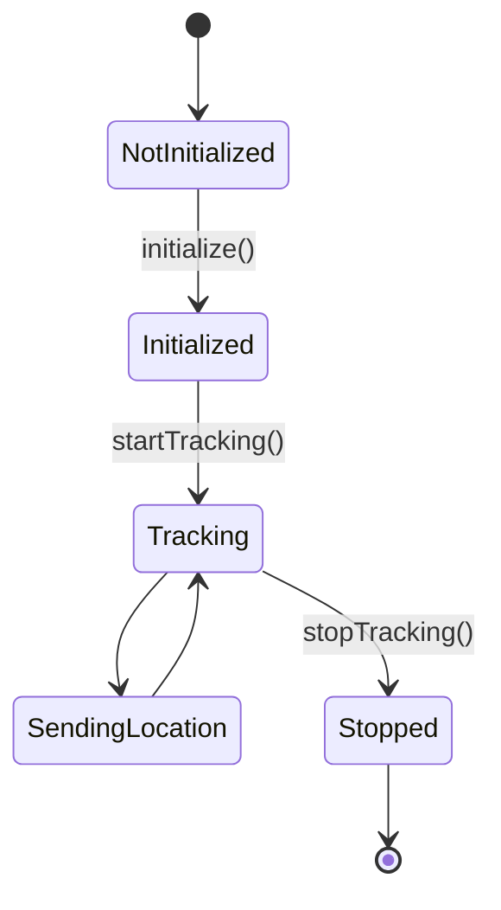
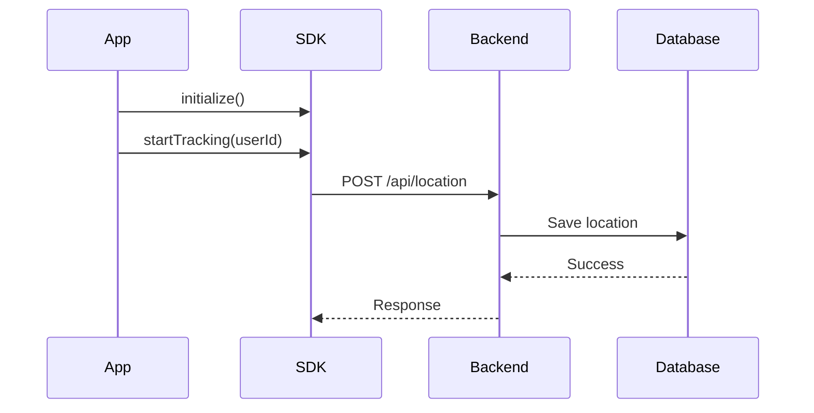

<p align="center">
  
</p>

<h1 align="center">SmartMotion SDK</h1>

<p align="center">
Lightweight Android SDK for real-time location tracking, backend processing and live analytics.
</p>

---

# Overview

SmartMotion SDK is an Android SDK that enables applications to collect GPS locations in real time and send them securely to a backend server.

The backend validates every request, generates an H3 spatial index for each location, stores the data in PostgreSQL, and exposes REST endpoints that are consumed by the SmartMotion Dashboard.

The SmartMotion Dashboard provides live monitoring through statistics, H3 heatmaps and analytics.

## Live Dashboard

[Open SmartMotion Dashboard](https://smart-motion-f95mi8i9y-maya-yakobi.vercel.app/)

---

# Features

- Android SDK for real-time location tracking
- Simple SDK integration
- Continuous GPS location updates
- Secure communication using Retrofit
- API Key authentication
- H3 spatial indexing
- PostgreSQL storage
- Live monitoring dashboard
- Interactive H3 heatmap
- Crowd analytics
- Connected applications monitoring

---

# Technology Stack

| Layer | Technology |
|--------|------------|
| Mobile SDK | Kotlin |
| Location Services | Google Play Services |
| Networking | Retrofit 2 |
| HTTP Client | OkHttp |
| JSON | Gson |
| Backend | Node.js + Express |
| Database | PostgreSQL |
| Spatial Indexing | H3 |
| Dashboard | Next.js |
| Frontend | React |
| Maps | Leaflet |
| Charts | Recharts |

---

# Project Structure

```text
SmartMotionSDK
│
├── smartmotion-sdk/
│   ├── models/
│   ├── network/
│   ├── tracking/
│   ├── SmartMotion.kt
│   ├── SmartMotionClient.kt
│   └── SmartMotionConfig.kt
│
├── backend-server/
│   ├── config/
│   ├── controllers/
│   ├── routes/
│   ├── services/
│   └── utils/
│
├── smartmotion-console/
│   ├── app/
│   └── components/
│
├── assets/
├── docs/
└── README.md
```

---

# Installation

Add the SmartMotion SDK dependency to your Android project.

```gradle
dependencies {
    implementation("com.github.MayaYakobi131:smartmotion-sdk:1.0.0")
}
```

Minimum requirements:

- Android API 26+
- Internet permission
- Fine Location permission

Required permissions:

```xml
<uses-permission android:name="android.permission.INTERNET"/>

<uses-permission android:name="android.permission.ACCESS_FINE_LOCATION"/>

<uses-permission android:name="android.permission.ACCESS_COARSE_LOCATION"/>
```

---

# Implementation

The SmartMotion platform consists of three independent components that work together to provide end-to-end location tracking and visualization.

### Android SDK

Responsible for:

- SDK initialization
- GPS location tracking
- Creating `LocationData`
- Sending location updates to the backend

### Backend Server

Responsible for:

- API Key validation
- Location validation
- H3 index generation
- PostgreSQL storage
- Analytics generation

### SmartMotion Dashboard

Responsible for:

- Displaying live users
- Displaying H3 heatmaps
- Displaying analytics
- Displaying connected applications

---

# Quick Start

## 1. Create the SDK configuration

```kotlin
val config = SmartMotionConfig(
    apiKey = "YOUR_API_KEY",
    serverUrl = "http://YOUR_SERVER:3000"
)
```

## 2. Initialize the SDK

```kotlin
SmartMotion.initialize(
    context = this,
    config = config
)
```

## 3. Start location tracking

```kotlin
SmartMotion.startTracking(
    userId = "user_123"
)
```

While tracking is active, the SDK:

- Requests GPS updates
- Creates `LocationData`
- Sends every location to the backend server

## 4. Stop tracking

```kotlin
SmartMotion.stopTracking()
```

Once tracking is stopped, the SDK unregisters the location callback and no additional location updates are sent.

---

# SDK Public API

The SDK exposes a small public API for Android applications.

| Function | Description |
|----------|-------------|
| `initialize(context, config)` | Initializes the SDK. |
| `isInitialized()` | Returns whether the SDK has been initialized. |
| `startTracking(userId)` | Starts location tracking for a user. |
| `stopTracking()` | Stops location tracking. |
| `sendLocation(locationData)` | Sends a location manually to the backend. |
# Internal Components

The following classes are used internally by the SDK.

| Class | Responsibility |
|--------|----------------|
| `LocationTracker` | Receives GPS updates using Google Play Services. |
| `SmartMotionClient` | Connects the SDK with the networking layer. |
| `ApiService` | Sends HTTP requests using Retrofit. |
| `LocationData` | Represents a location event. |

---

# REST API

The backend exposes REST endpoints used by both the Android SDK and the SmartMotion Dashboard.

| Method | Endpoint | Description |
|---------|----------|-------------|
| POST | `/api/location` | Save a location update |
| GET | `/api/locations` | Return the latest location of each active user |
| GET | `/api/stats` | Return dashboard statistics |
| GET | `/api/heatmap` | Return H3 heatmap data |
| GET | `/api/top-areas` | Return the busiest H3 cells |
| GET | `/api/apps` | Return connected applications |
| GET | `/api/health` | Check server status |

---

# Authentication

Every request sent by the SDK includes an API Key in the request header.

```http
POST /api/location

x-api-key: sm_demo_key_123
Content-Type: application/json
```

The backend validates:

- API Key existence
- API Key activity
- Request payload

If validation fails, the server returns:

```http
401 Unauthorized
```

---

# Sample Request

```json
{
  "userId": "user_123",
  "latitude": 32.0822,
  "longitude": 34.7688,
  "timestamp": "2026-07-05T12:30:00Z"
}
```

---

# Sample Response

```json
{
  "success": true,
  "message": "Location saved successfully",
  "data": {
    "id": "live_user_123",
    "eventId": 125,
    "userId": "user_123",
    "appId": "demo_android_app",
    "latitude": 32.0822,
    "longitude": 34.7688,
    "timestamp": "2026-07-05T12:30:00Z",
    "h3Index": "892d80cc173ffff",
    "updatedAt": "2026-07-05T12:30:02Z"
  }
}
```

---

# Database

Each location received by the backend is stored as a separate event in the PostgreSQL database.

| Column | Type |
|---------|------|
| id | SERIAL |
| userId | TEXT |
| appId | TEXT |
| latitude | DOUBLE PRECISION |
| longitude | DOUBLE PRECISION |
| h3Index | TEXT |
| timestamp | TEXT |
| receivedAt | TEXT |

Database indexes:

- Primary Key (`id`)
- Index on `userId`
- Index on `h3Index`

Indexes improve query performance for user lookups and H3-based aggregations.

> **Note:** API Keys are stored in `config/apiKeys.js` and are validated before inserting location events into the database.

---

# Database Performance

| Operation | Complexity |
|-----------|------------|
| Insert location | **O(1)** |
| Search by User ID | **O(log n)** |
| Search by H3 Index | **O(log n)** |
| Latest user locations | **O(n)** |
| Heatmap generation | **O(n)** |

---

# System Diagrams

## Overall Architecture



---

## Backend Flow


---

## Database Model



---

## SDK State Diagram



---

## Request Sequence



---

# Screenshots

The screenshots below demonstrate the Android application and the SmartMotion Dashboard.

---

## Android Demo Application

<p align="center">
  
</p>

The Android application initializes the SDK, starts location tracking and sends live location updates to the backend.

---

## SmartMotion Dashboard

<p align="center">
  
</p>

The dashboard displays live statistics, connected applications and active users.

---

## Live H3 Heatmap

<p align="center">
  
</p>

The heatmap visualizes active users grouped into H3 spatial cells.

---

## Analytics

<p align="center">
  
</p>

The analytics view presents the busiest H3 cells and the current crowd distribution.
# Demo Video

The demonstration includes:

1. Starting the backend server.
2. Opening the SmartMotion Dashboard.
3. Launching the Android Demo application.
4. Initializing the SDK.
5. Starting location tracking.
6. Sending live location updates.
7. Viewing live updates in the dashboard.
8. Stopping location tracking.

## Live Dashboard

[Open SmartMotion Dashboard](https://smart-motion-f95mi8i9y-maya-yakobi.vercel.app/)

## Demo Video

[Watch SmartMotion SDK Demo](https://www.renderforest.com/watch-117362347?queue_id=193896427&quality=0)

---

# Documentation

Additional developer documentation is available in:

```text
docs/DEVELOPER_GUIDE.md
```

The guide explains:

- SDK integration
- Configuration
- Implementation
- Public SDK functions
- Creating location events
- Dashboard usage
- Example use cases

---

# Author

Developed and maintained by

**Maya Yakobi**