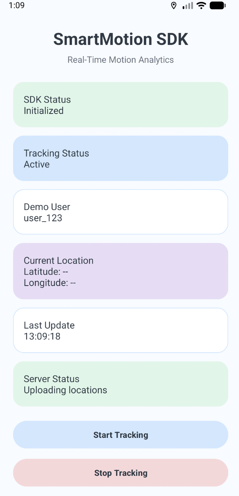
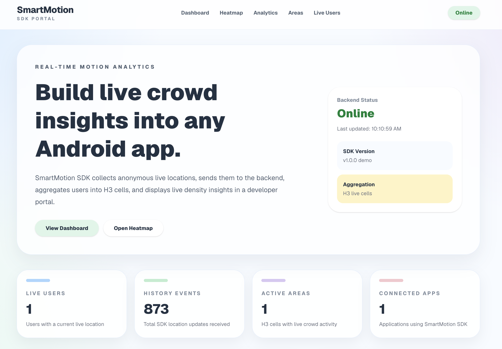
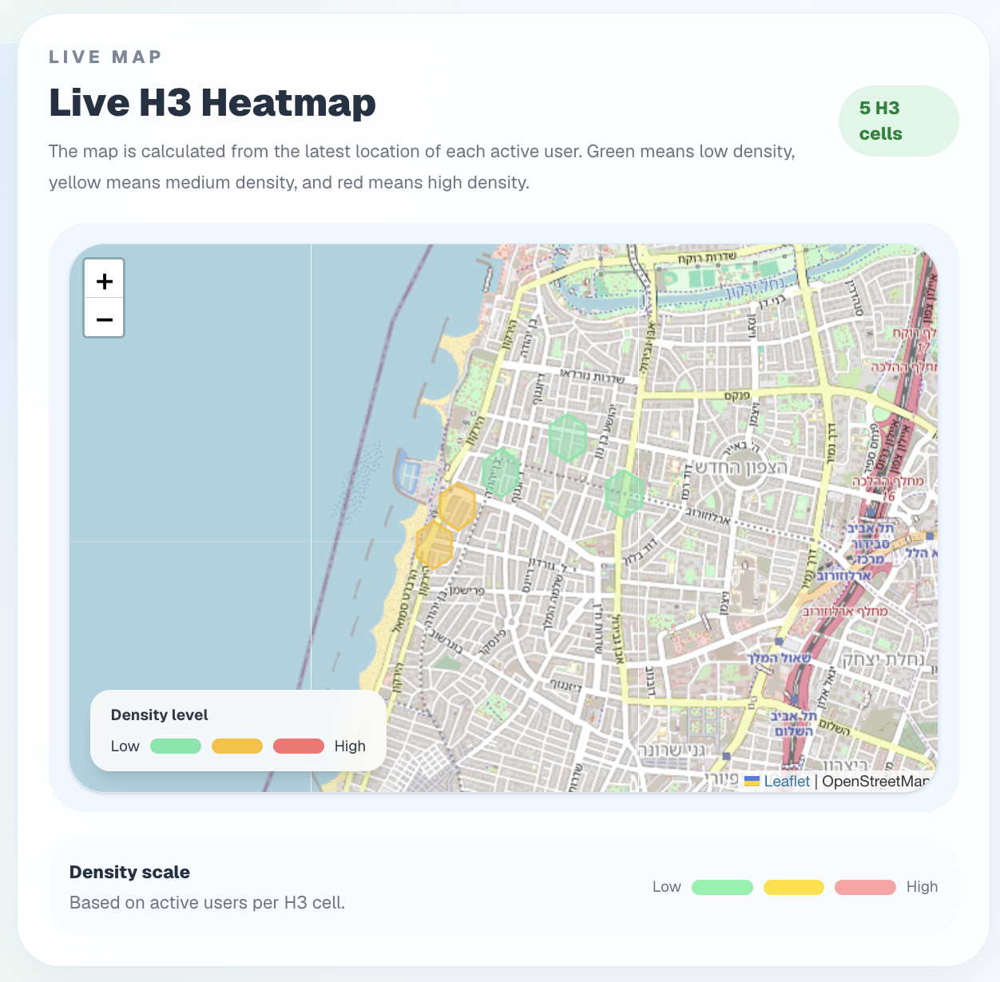
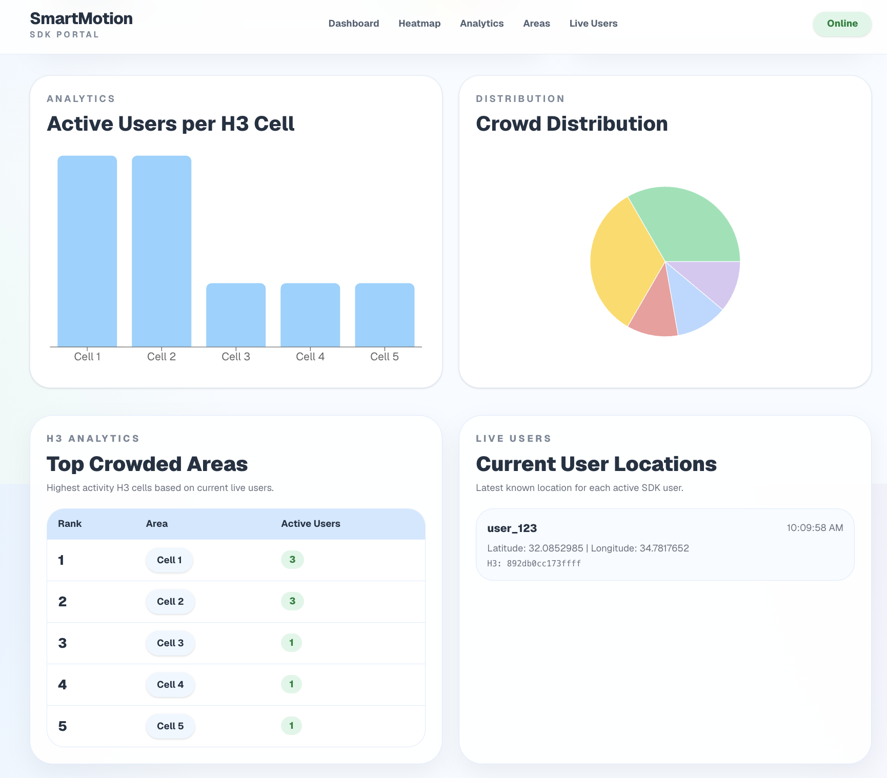

# SmartMotion SDK Developer Guide

Welcome to the SmartMotion SDK Developer Guide.

This guide explains how to integrate the SmartMotion SDK into an Android application, how to start location tracking, how location events are processed by the backend, and how to monitor live data using the SmartMotion Dashboard.

The guide is intended for Android developers who want to quickly integrate the SDK and understand the complete workflow of the SmartMotion platform.

---

# SmartMotion Dashboard

The SmartMotion Dashboard is available online:

### https://smart-motion-f95mi8i9y-maya-yakobi.vercel.app/

The dashboard displays live information received from the backend, including:

- Live Users
- History Events
- Active H3 Areas
- Connected Applications
- Live Heatmap
- Analytics Charts

The dashboard refreshes automatically every five seconds while the backend is running and new location events are received.

---

# Who Can Use SmartMotion SDK?

SmartMotion SDK can be integrated into any Android application that requires real-time location tracking.

Example use cases include:

- Delivery applications
- Bike and scooter sharing systems
- Navigation applications
- Tourist guide applications
- Smart city platforms
- Shopping malls and visitor analytics
- University campus applications
- Event management systems

Because the SDK continuously sends location updates, it can be used in any application that needs live movement analytics.

---

# Before You Start

Before integrating the SDK, make sure the following requirements are met.

### Android Application

Your Android project should use:

- Android API 26 or higher
- Google Play Services Location
- Internet permission
- Fine Location permission

### Backend Server

Start the backend server before running the Android application.

The SDK communicates with the backend using HTTP requests.

### SmartMotion Dashboard

Open the dashboard to monitor incoming location updates in real time.

Dashboard URL:

https://smart-motion-f95mi8i9y-maya-yakobi.vercel.app/

---

# Get Started

Integrating SmartMotion SDK requires only a few simple steps.

1. Add the SDK dependency.
2. Configure the SDK.
3. Initialize the SDK.
4. Grant location permission.
5. Start location tracking.
6. Open the SmartMotion Dashboard.
7. Watch live location updates.

The following sections explain each step in detail.

---

# Installation

Add the SDK dependency to your Android project.

```gradle
dependencies {
    implementation("com.github.MayaYakobi131:smartmotion-sdk:1.0.0")
}
```

Required Android permissions:

```xml
<uses-permission android:name="android.permission.INTERNET"/>

<uses-permission android:name="android.permission.ACCESS_FINE_LOCATION"/>

<uses-permission android:name="android.permission.ACCESS_COARSE_LOCATION"/>
```

After completing these steps, the SDK is ready to be configured and initialized.
# Implementation

Integrating SmartMotion SDK into an Android application consists of four simple steps.

---

## Step 1 – Create the SDK Configuration

Create a `SmartMotionConfig` object containing the API Key and the backend server address.

```kotlin
val config = SmartMotionConfig(
    apiKey = "YOUR_API_KEY",
    serverUrl = "http://YOUR_SERVER:3000"
)
```

The API Key identifies the application, while the server URL specifies where location updates will be sent.

---

## Step 2 – Initialize the SDK

Initialize the SDK once after the application starts.

```kotlin
SmartMotion.initialize(
    context = this,
    config = config
)
```

During initialization the SDK:

- Stores the SDK configuration.
- Creates the internal networking client.
- Creates the location tracker.
- Prepares the SDK for receiving location updates.

After initialization the SDK is ready to start tracking.

---

## Step 3 – Grant Location Permission

Before tracking can begin, the application must receive the Android location permission.

If the permission is granted, the SDK can receive GPS updates.

If the permission is denied, location tracking will not start.

---

## Step 4 – Start Tracking

Start location tracking by calling:

```kotlin
SmartMotion.startTracking(
    userId = "user_123"
)
```

Once tracking starts, the SDK automatically:

- Receives GPS updates.
- Creates a `LocationData` object.
- Sends every location update to the backend server.
- Continues tracking until stopped.

No additional networking code is required.

---

# Android Demo Application

The project includes a demo Android application that demonstrates the SDK integration.

<p align="center">
    
</p>

The demo application includes:

- SDK Status
- Tracking Status
- User ID
- Current Location
- Last Update Time
- Server Status
- Last Server Response
- Start Tracking button
- Stop Tracking button

The application requests the required location permission, initializes the SDK and allows the developer to start or stop location tracking.

---

# How to Use

### Start Tracking

Press **Start Tracking**.

The SDK begins requesting location updates from the device and automatically sends them to the backend.

---

### Stop Tracking

Press **Stop Tracking**.

The SDK stops requesting new GPS updates and no additional location events are sent.

---

### Monitor the Dashboard

Open the SmartMotion Dashboard:

https://smart-motion-f95mi8i9y-maya-yakobi.vercel.app/

While tracking is active you can observe:

- Active users
- New location events
- Updated H3 heatmap
- Analytics charts
- Connected applications

The dashboard refreshes automatically every five seconds.

---

# Implementation Flow

The SmartMotion workflow is straightforward:

1. Initialize the SDK.
2. Grant location permission.
3. Start tracking.
4. Receive GPS updates.
5. Send location events to the backend.
6. Store the data in PostgreSQL.
7. Display live information in the SmartMotion Dashboard.
# Creating a New Event

In SmartMotion SDK, every location update is considered a new event.

When location tracking is active, the SDK automatically creates a `LocationData` object for every GPS update received from the device.

Each event contains:

```json
{
  "userId": "user_123",
  "latitude": 32.0822,
  "longitude": 34.7688,
  "timestamp": "2026-07-05T12:30:00Z"
}
```

The SDK sends the event to the backend using the configured API Key.

The backend then:

- Validates the API Key
- Validates the location data
- Generates an H3 spatial index
- Stores the event in PostgreSQL
- Makes the new data available to the dashboard

No additional code is required once tracking has started.

---

# Other SDK Functions

Besides starting and stopping location tracking, SmartMotion SDK provides several helper functions.

### Check SDK Status

```kotlin
SmartMotion.isInitialized()
```

Returns `true` if the SDK has already been initialized.

---

### Get Current Configuration

```kotlin
SmartMotion.getConfig()
```

Returns the current SDK configuration.

---

### Send a Location Manually

```kotlin
SmartMotion.sendLocation(locationData)
```

Sends a `LocationData` object directly to the backend.

This function can be useful when location information is collected from another source instead of the built-in tracker.

---

# SmartMotion Dashboard

The SmartMotion Dashboard provides a real-time view of the information collected by the SDK.

Dashboard URL:

https://smart-motion-f95mi8i9y-maya-yakobi.vercel.app/

<p align="center">
    
</p>

The dashboard displays:

- Live Users
- History Events
- Active H3 Areas
- Connected Applications

The displayed information is updated automatically while new location events are received.

---

# Live Heatmap

<p align="center">
    
</p>

The heatmap groups nearby users into H3 cells.

Each H3 cell represents an area containing active users.

Cell colors indicate activity level:

- 🟢 Low activity
- 🟡 Medium activity
- 🔴 High activity

This allows developers to quickly identify crowded areas.

---

# Analytics

<p align="center">
    
</p>

The analytics page summarizes the collected location data.

Current analytics include:

- Active users per H3 cell
- Crowd distribution
- Top active areas

Charts are refreshed automatically as new location events are received.

---

# Example Applications

SmartMotion SDK can be integrated into many different Android applications.

Examples include:

### Delivery Platforms

Monitor delivery drivers and visualize active delivery areas.

---

### Bike and Scooter Sharing

Track vehicle locations and identify high-demand zones.

---

### Navigation Applications

Display live user movement and improve route monitoring.

---

### Tourist Guide Applications

Monitor guided tours and visualize visitor locations.

---

### Smart City Solutions

Collect anonymous location information to analyze movement patterns across different areas.
# Best Practices

To achieve the best results when using SmartMotion SDK, follow these recommendations.

- Initialize the SDK only once during the application lifecycle.
- Request location permission before starting location tracking.
- Verify that the backend server is running before starting the SDK.
- Use a valid API Key configured on the backend.
- Monitor the SmartMotion Dashboard to verify that new location events are being received.

Following these guidelines helps ensure reliable communication between the Android application, the backend server and the dashboard.

---

# Troubleshooting

## The SDK is not initialized

**Possible cause**

`SmartMotion.initialize()` was not called before starting location tracking.

**Solution**

Initialize the SDK before calling any other SmartMotion function.

---

## No location updates are received

Check the following:

- Location permission has been granted.
- GPS is enabled on the device.
- Tracking has been started.
- The application has internet access.

---

## The dashboard does not display new events

Verify that:

- The backend server is running.
- The configured `serverUrl` is correct.
- A valid API Key is being used.
- The Android application is actively sending location updates.

---

# Demo Video

A demonstration video will be added after the final recording.

The recommended demonstration flow is:

1. Start the backend server.
2. Open the SmartMotion Dashboard.
3. Launch the Android Demo application.
4. Initialize the SDK.
5. Start location tracking.
6. Observe new location events in the dashboard.
7. View the updated heatmap and analytics.
8. Stop location tracking.

Dashboard:

https://smart-motion-f95mi8i9y-maya-yakobi.vercel.app/

> **Demo Video:** *(Video link will be added here.)*

---

# Summary

The SmartMotion platform consists of three main components:

- Android SDK for collecting location updates.
- Node.js backend for processing and storing data.
- SmartMotion Dashboard for visualizing live information.

Together, these components provide a complete workflow for collecting, processing and displaying real-time location data.

---

# Author

Developed by

**Maya Yakobi**